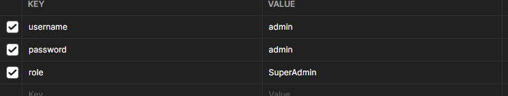
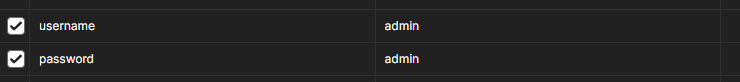
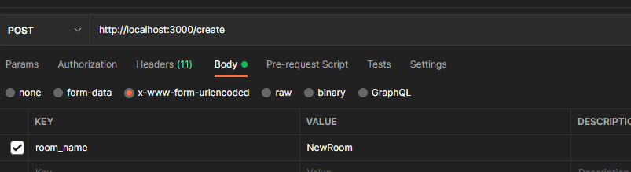
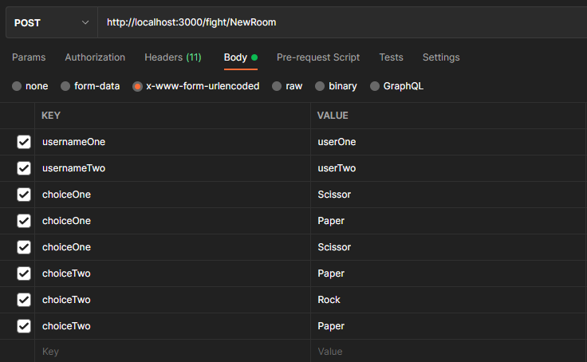

# Overview

Binar Academy challenge for chapter 7. Made suit game with Express, Postgres, JWT

Challenge Demo: [Youtube](https://youtu.be/WtWFddug708)

## How to install

Install the node_modules first

`npm install`

Run server with (nodemon)

`npm start`

## How to test

POST `/register`
Available Role : SuperAdmin & PlayerUser

POST `/login`

POST `/create`
Need SuperAdmin Token

POST `/fight/:roomName`
Need PlayerUser Token

## Author

- althafdaa
